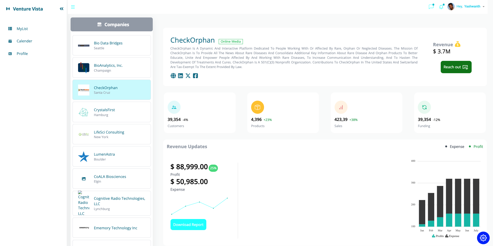

# Venture Vista
**Created by:** Yashwanth




## User Service

Venture Vista's user service is developed using Node.js with Express framework and TypeScript. The code follows the clean architecture or vertical slice architecture, where each feature such as login, register, companies, investments has its own folder with controllers, middleware, service, and models. This architecture helps in organizing the codebase and making it more maintainable and scalable. TypeScript is used to add static typing to JavaScript, providing better code quality and developer experience.

The database connection is managed as an external dependency (`externalService` file), and the CQRS (Command Query Responsibility Segregation) pattern is followed for CRUD operations for database operations. CQRS helps in separating the read and write operations, leading to better performance and scalability of the application.

### Commands

1. `npm run build`: Build the server.
2. `npm run serve`: Run the server.

## Frontend Service

Venture Vista's frontend is developed using React, Tailwind CSS, and Syncfusion for charts. React is a popular JavaScript library for building user interfaces, Tailwind CSS is a utility-first CSS framework for rapidly building custom designs, and Syncfusion provides a rich set of UI components, including charts, for building interactive data visualizations.

### Commands

1. `npm install`: Install dependencies.
2. Create `.env` file using `.env.example`.
3. `npm run start`: Start the development server.


## Docker

Venture Vista is containerized using Docker. Docker containers provide a consistent environment for running applications, making it easier to deploy and manage them across different environments. Docker Compose is used to define and run multi-container Docker applications. 

The `docker-compose.yml` file defines the services required for Venture Vista, including the frontend, user service, and a PostgreSQL database. Use the following command to build all the required images and containers:

```bash
docker-compose up --build
```

## Postman Collection

For easy testing and interaction with Venture Vista's APIs, we provide a Postman collection. Postman is a popular API client that allows you to explore, test, and debug APIs more efficiently.

### Installation

1. If you haven't already, [download and install Postman](https://www.postman.com/downloads/).
2. Once installed, launch Postman.

### Importing the Collection

1. Download the Venture Vista Postman collection file from [this link](/ScaleIP.postman_collection.json).
2. In Postman, click on the **Import** button located in the top-left corner.
3. Choose the downloaded JSON file.
4. Click **Open** to import the collection into your Postman workspace.

### Usage

1. After importing the collection, you'll find it listed in the Collections tab on the left sidebar.
2. Click on the Venture Vista collection to expand it and view available requests.
3. Adjust request parameters as needed (such as endpoint URLs, request body, headers, etc.).
4. Click on **Send** to execute the request.
5. View the response returned by the server in the Response section below.

Feel free to explore and interact with the various endpoints provided in the collection to understand the functionality of Venture Vista's APIs.
